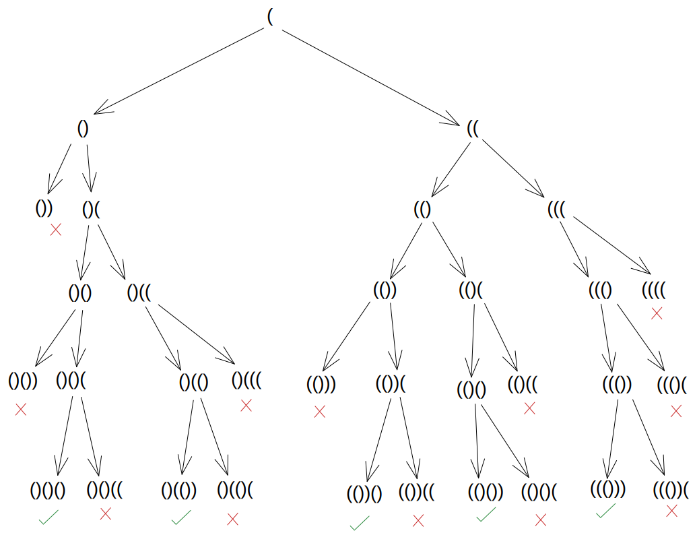

# Generate Parentheses

https://leetcode.com/explore/challenge/card/june-leetcoding-challenge-2021/605/week-3-june-15th-june-21st/3781/

Problem statement -

Given n pairs of parentheses, write a function to generate all combinations of well-formed parentheses. 

Example 1:

```
Input: n = 3
Output: ["((()))","(()())","(())()","()(())","()()()"]
```

Example 2:

```
Input: n = 1
Output: ["()"]
```

Constraints:

- `1 <= n <= 8`

---

Looking at the problem statement, it says "generate all combinations" and "well-formed parentheses". Those are two different problems to solve I guess

I can think of some ways to solve this as a first step

First way -
- Have a generator function which can generate all permutations of parentheses. Notice how I said permutation. So, this would mean that, I might create even some wrong / not-well-formed parentheses. For example `)()(` for n = 2. I can put them in any order, and get all possible orders enumerated
- Have a checker function which can tell if a given pair of parentheses is well-formed or not

Put those together, then we can do generation first, and then filter out the malformed parenthesis and get the final result

The downsides of this kind of method is - the program spends time enumerating / generating values that could be filtered by the checker function. This is a waste of time and resources (CPU, RAM)

Second way - Another solution, which kind of looks like an ideal solution now, that would be - to have the ability to directly generate well-formed parenthesis only always, without having to prune wrong / malformed parenthesis combinations and hence optimizing on the time and resources

Second way is a comparatively a better solution

Let's see how we can first solve the problem the first way and then take the learnings and try the second way :)

---

First way - Permutation + Filter

For permutation, I'm thinking of recursion. At least that's what came up in my mind as the first thing. I could also do loops I think. From what I remember, one can implement a recursion like feature with just loops. Specifically a stack like feature, as recursion simply uses stack - function stack and the recursive function calls just stack up. Gotta think if the thing I thought about loop makes sense. Only an implementation will tell I guess 😅 As that was more of a recall than a sure thing. Stack thing makes sense though, unlike loops

I was writing down in pen and paper and thinking about the permutation problem

It's a tricky thing :P

For example, for n = 3, the permutations are less compared to the permutations of a 6 length string where any character can be a `(` or `)`. The question mentions well-formed parenthesis, so the ideally number of `(` and `)` will be same and for n = 3, it will be 3 `(` and 3 `)`. But in permutation, I might generate something like `((((((` for n = 3, which has 6 `(`s which is more than 3 `(`s for n = 3

I'm already starting to optimize, lol. Looking at the wrong values and eliminating them

I can already see my mind's checker function working, lol

Also, for n = 3, if I start generating all kinds of 6 length strings with any number of `(` and `)`, that's like 2 ^ 6 values!! :O which is 64 values. How?

For n = 3, 6 length strings = 6 characters. Each character can be `(` or `)`. Not considering the fact that according to the question only 3 `(` and 3 `)` should be present and also in a well-formed manner.

So, each position in the 6 length string has 2 possible values - `(` or `)` and that leads to the permutation concept value that - you can multiply all the number of possible values - which is 2 * 2 * 2 * 2 * 2 * 2 = 2 ^ 6

And then we have to of course filter out the wrong values!!

Looking at the sample output, for n = 3, there are only 5 values in the output!! :O So, I would be having 59 values wrong out of 64 generated values. Wow

I think I really need to think about how to reduce the possibility of generating wrong values by using the checker function as early as possible and not after generating all values, and not after generating each value and then moving on to generate all values and also check all values

So,

Generate all 2^(2*n) values and then run checker function for all values -> NO

Generate each value and then run checker function for each value, and do this 2^(2*n) times, which is the count of all possible generated values -> NO. Something to note is, in this method though, I could do a better thing. While drawing a small graph / tree looking at how I could enumerate different values, I came up with something like this -



Some of the cases where we know we can't proceed further -
- We can't have more characters after an not-balanced / not-paired closing parenthesis, like this - ()) , whatever we append to it, it's going to be a wrong value at the end. For example ())() is still wrong, ())(()) is still wrong! We can check this case when the last character is a closing `)` parenthesis and is an unmatched / not-balanced / not-paired closing parenthesis and others are all paired up with their counter-parts `)`

- There's already too many `(` or `)` characters. For example, for n = 3, the max number of `(`s is 3, same for max number of `)`, it's 3. This can be especially useful when the first case doesn't happen, that is when the last character is a `(`


Finally, we can see that we have the five values we needed! :)

Looking at the kind of path finding we had to go through, we had 6 levels in above tree / graph

The levels depends on n. For n = 3, it's 2 * n. How? As the levels = total number of characters in the final output = n number of `(` and n number of `)` = n + n = 2 * n

Fortunately, many a times we didn't have to do value finding in some paths where we realized that a value cannot lead to a proper output

I think the checker we will write for such checks will be more of a - "can this prefix lead to a valid output?" kind of checker, rather than a "is it a well formed parenthesis?". Though we could have that kind of checker too I guess. I don't see the need though, let's see. It would be more of an extra check I guess. I mean, we would be able to eliminate all the wrong values for sure, and then with the right values, we can do extra checks too 🤷

I'm gonna think about the time complexity for this algorithm and also think how to implement it and then start thinking about other ways to implement the same thing. Some easier ways maybe! :) Something less complex? This is less complex too actually :)

Looking at the above tree, we had to traverse / check through 33 values. Hmm

Maybe I can do some optimizations like, if there are already balanced number of `(` and `)`, then don't add a `)` as that will not work out

Another optimization could be like - keep count of the `(` and `)` present in the current value and then don't add more if there's already max number of `(` or `)`. This will reduce creating a wrong value and then checking if that value is wrong and then marking it as a wrong value. Instead we will not even produce that value - hence no checks and of course as before no parsing or processing based on that wrong value going forward

Doing those - we can reduce 12 wrong values from 33 values to be checked / processed, which puts us to 33 - 12 = 21 ! :D

Now I'm writing tests. Now that I think about it, it can also be solved in a dynamic programming method I guess :O I gotta think about it!

As I'm writing test for n = 1, next n = 2, I was thinking -

n = 1, output = ()

n = 2, output = ()(), (())

n = 3, output = ()()(), ((())), (()()), (())(), ()(())


For example, for n = 2, I can think like this - 

Let's take n = 1, that's (), for n = 2, there's two sets / pairs of parenthesis. Assuming there's already one, that is n = 1, that is (), another pair can be put where? Either along side it, like this ()() or inside the parenthesis like this (()). Also, putting on the left or right doesn't matter when putting alongside, as both lead to the same result in this case! And that's the output for n = 2! I think that's the output - ()(), (()), as written above

Let's take n = 3 now. Starting with n = 2, the output for n = 2 is ()() and (()). Now we have two sets / pairs of parenthesis already, we just need one more set / pair parenthesis. Where can this one more set go? Either along side the existing ones, or inside them! :) So,

()() -> put one pair along side -> ()()() - here the side (left / right) doesn't matter!

()() -> put one pair inside -> (())(), ()(()) - it can be inside any one of them!

(()) -> put one pair along side -> (())(), ()(()) - here the side (left / right) matters! Note that the result is same as the above! :)

(()) -> put one pair inside -> (()()), ((())) - note how inside meant along side for the inner parenthesis ? :D

That's it, that way we get 5 values!! :D :D

()()(), (())(), ()(()), (()()), ((()))

Wow! :D :D

Perfect eh? ;) Along side and inside concept. The only tricky thing is - I need to find a proper algorithm to understand how to put parenthesis along side and inside :P Lol

Along side is easy I guess - append to the left or right

Inside ain't so easy!! Especially when I have to look for multiple vacancies inside, hmm

Something to note is - we can sometimes have same value coming up. I think using some sort of Set like structure would help while storing the results, instead of lists, so that all the elements are unique at the data storage level :) Or we will have to deduplication. I guess one way or the other that has to happen :) Ideally efficiently, so, using built-in functions or data structures doesn't mean everything is efficient 😅

I'm using JavaScript for now and using `jest` for testing :D

```bash
$ npx jest
 PASS  ./generate-parenthesis.spec.js
  Generate Parenthesis
    ✓ n = 1 (3 ms)

Test Suites: 1 passed, 1 total
Tests:       1 passed, 1 total
Snapshots:   0 total
Time:        0.366 s, estimated 1 s
Ran all test suites.
```

There's one proper test and two other dummy tests

```bash
$ npx jest
 PASS  ./generate-parenthesis.spec.js
  Generate Parenthesis
    ✓ n = 1 (3 ms)
    ✓ n = 2
    ✓ n = 3

Test Suites: 1 passed, 1 total
Tests:       3 passed, 3 total
Snapshots:   0 total
Time:        0.439 s, estimated 1 s
Ran all test suites.
```

